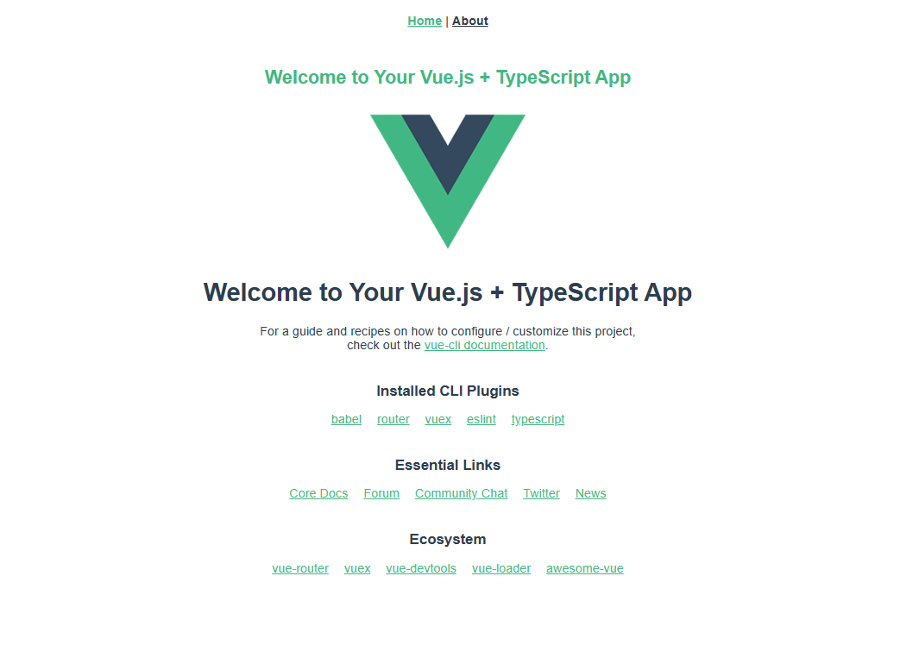

# vue2 + webpack5 项目模板




## 特性

- [x] 添加开发缓存，提高响应速度
- [x] gzip 支持
- [x] 选项式语法和组合式语法支持
- [x] scss支持
- [x] vue-router + vuex 支持
- [x] typescipt支持

## tip

### setup使用router参数

```vue

<script lang="ts" setup>
import { reactive, toRefs, computed } from 'vue';
import { useRoute, useRouter } from 'vue-router/composables';
const route = useRoute();
const id = computed(() => route.query.id);
const state = reactive({
  count: 0,
});
</script>
<style lang="scss" scoped>
.id {
  color: red;
}
</style>

```

### 参考文档

[迁移至 Vue 2.7 — Vue.js (vuejs.org)](https://v2.cn.vuejs.org/v2/guide/migration-vue-2-7.html)


## dependencies

```json
"dependencies": {
    "compression-webpack-plugin": "^10.0.0",
    "core-js": "^3.8.3",
    "vue": "^2.6.14",
    "vue-router": "^3.5.1",
    "vuex": "^3.6.2"
  },
```


## Project setup

```
yarn install
```

### Compiles and hot-reloads for development
```
yarn serve
```

### Compiles and minifies for production
```
yarn build
```

### Lints and fixes files
```
yarn lint
```

